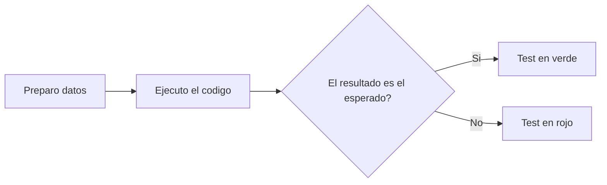
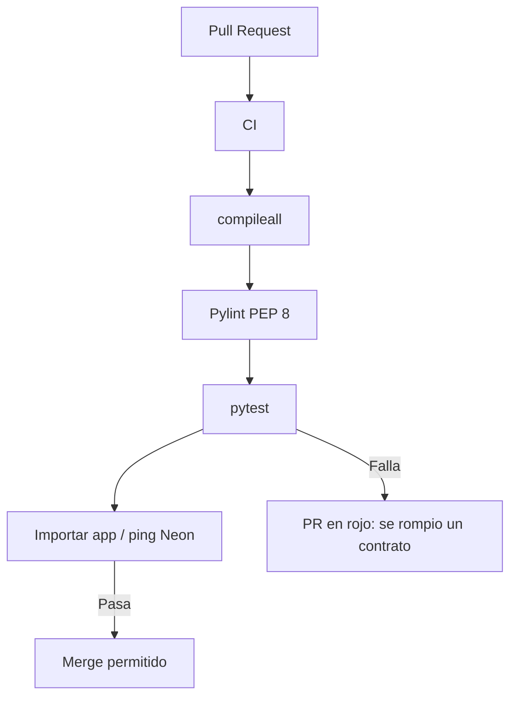
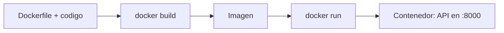
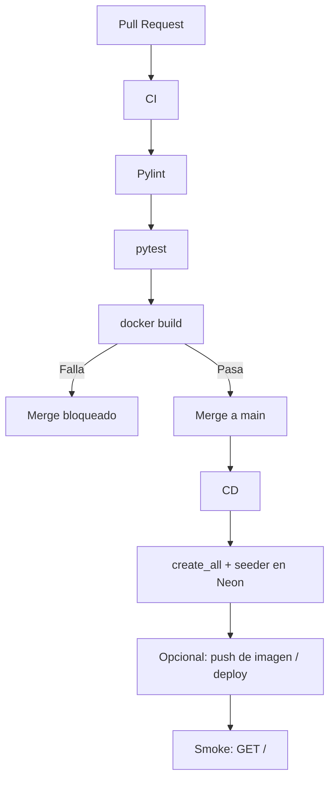

# Guía: Tests con pytest y Docker en CI/CD

Cómo **comprobar que la API hace lo que promete** y cómo **empaquetarla igual en tu PC, en GitHub Actions y en el servidor**.

La teoría de APIs está en [`README.md`](README.md), el taller de base de datos en [`GUIA-NEON-ORM.md`](GUIA-NEON-ORM.md) y el pipeline en [`README-PIPELINE.md`](README-PIPELINE.md). Esta guía responde a dos preguntas que el CI actual todavía no cubre del todo:

1. El código **compila** y **se importa**. ¿Las rutas devuelven el JSON y los códigos HTTP correctos?
2. En el runner de GitHub **no está tu Windows ni tu `.env`**. ¿Cómo hacemos que el proyecto arranque igual en todas partes?

---

## Parte A — Tests y pytest

---

## 1. ¿Qué es un test?

Un **test** (prueba automatizada) es un programa pequeño que:

1. prepara una situación (datos de entrada);
2. ejecuta **una unidad de tu código** (función, endpoint, consulta);
3. **comprueba** que el resultado es el esperado.

Si la comprobación falla, el test **falla**. No es una opinión: es un sí o un no.

En este curso ya “probamos” a mano con `/docs`, Postman o `curl`. Eso sirve para explorar. Un test automatizado sirve para **repetir la misma comprobación siempre**, en tu máquina y en el CI, sin que nadie recuerde los pasos.



Ejemplo mínimo, sin framework:

```python
def suma(a, b):
    return a + b


assert suma(2, 3) == 5
```

`assert` significa: “si esto no es verdad, aborta”. pytest convierte esos `assert` en un reporte legible (qué esperabas, qué salió).

Un test **no es**:

- imprimir y mirar la consola;
- “probarlo en `/docs` cuando me acuerde”;
- el script del seeder (ese **cambia** la base; un test **verifica** sin depender de tu Neon de trabajo).

---

## 2. ¿Por qué se usa?

Porque el código cambia. Hoy `GET /personas/{id}` devuelve 404 si no existe. Mañana alguien toca el CRUD y el 404 se vuelve `None` o un 500. Sin tests, el CI sigue verde: el módulo se importa igual.

Lo que ganamos:

- **Regresión.** Un bug que ya se corrigió no vuelve a `main` sin que alguien se entere.
- **Contrato de la API.** El test documenta: “crear persona responde 201 y un `id`”.
- **Refactor seguro.** Puedes reorganizar `src/crud` si los tests de la ruta siguen pasando.
- **CI con dientes.** Pylint mira estilo. El test mira **comportamiento**.

El costo es escribir y mantener las pruebas. En un CRUD académico, unas cuantas por recurso alcanzan.

---

## 3. Tipos de test (y cuándo usar cada uno)

| Tipo | Qué toca | Velocidad | Cuándo usarlo |
| --- | --- | --- | --- |
| **Unitario** (*unit test*) | Una función o clase, **sin** red ni base real | Muy rápido | Validaciones, cálculos, ramas `if`/`raise` del CRUD o de un schema |
| **Integración** | Varias capas juntas (API + ORM + BD de prueba) | Media | “`POST /personas` deja la fila y `GET` la lee” |
| **De API / contrato** | HTTP: método, URL, código, JSON | Media | El contrato REST que ven Postman y el frontend |
| **Humo** (*smoke*) | “¿enciende?” | Rápida | Después del deploy: `GET /` da 200 |
| **Extremo a extremo** (*E2E*) | Flujo de usuario real (navegador, varios servicios) | Lenta | Casi no en este curso; es más de frontend |

Pirámide (de más a menos, en cantidad):

```text
        /\
       /E2E\          pocos, caros
      /------\
     / Integr. \       algunos, contra API o BD de prueba
    /----------\
   /  Unitarios \     muchos, baratos, aislados
  /--------------\
```

**En este repositorio**, lo más rentable es:

- **unitarios** del CRUD o de `Settings` (si no necesitan Neon);
- **tests de API** con `TestClient` de FastAPI (`GET /`, 404, 201, 422).

No hace falta Selenium ni abrir Chrome para calificar un CRUD.

---

## 4. ¿Qué es un unit test?

Un **unit test** comprueba **una unidad** de código **aislada**.

“Unidad” suele ser una función o un método. “Aislada” significa que **no depende** de PostgreSQL, de Neon, de internet ni de otro servicio. Si esos colaboradores hacen falta, se **simulan** (*mocks*) o se sustituyen.

Ejemplo alineado con este proyecto: `obtener_por_id` debe devolver `None` cuando `db.get` no encuentra la fila. Eso se puede probar pasando un objeto falso que imite `Session`, sin crear tablas.

```python
from uuid import uuid4

from src.crud.personas import obtener_por_id


class DbFalsa:
    def get(self, _modelo, _identificador):
        return None


def test_obtener_por_id_devuelve_none_si_no_existe():
    resultado = obtener_por_id(DbFalsa(), uuid4())
    assert resultado is None
```

Ahí pruebas **tu lógica**, no SQLAlchemy ni Neon.

### Cuándo sí usar unit tests

- Una función tiene varias ramas (`if persona is None: raise 404`).
- Quieres un resultado **inmediato** (cientos de tests en segundos).
- El fallo debe señalar **un archivo concreto**, no “algo en la base”.

### Cuándo no bastan

- Quieres saber si FastAPI, Pydantic y el router están **bien enchufados**.
- El bug es de SQL, de tipos UUID o de `create_all`.
- El contrato que te importa es HTTP (`201`, `422`, JSON).

Eso ya no es unitario: es un **test de API o de integración**. Siguen siendo tests; pytest ejecuta ambos.

### Qué no es un unit test (aunque viva en `tests/`)

- Llamar a Neon de verdad.
- Arrancar `uvicorn` y usar `curl`.
- Depender del seeder (`Ana Perez` tiene que existir).

Esos son útiles, pero son otra categoría: más frágiles y más lentos.

---

## 5. ¿Qué es pytest?

**pytest** es el framework de tests más usado en Python. No es un tipo de test: es la **herramienta** que descubre, corre y reporta las pruebas.

Por qué se usa en este curso:

- los tests son funciones `test_*` y `assert` normales, sin clases obligatorias;
- el reporte dice *expected* vs *got*;
- FastAPI lo documenta con `TestClient`;
- se corre igual en Windows y en el runner Ubuntu del CI: `pytest`.

Otras herramientas que vas a oír:

| Herramienta | Rol |
| --- | --- |
| **pytest** | Runner de tests |
| **unittest** | Librería de la biblioteca estándar; más verbosa |
| **httpx / TestClient** | Cliente HTTP contra la app **sin abrir un puerto** |
| **coverage** | Qué porcentaje del código ejecutaron los tests |

En el curso basta **pytest** + **TestClient**.

---

## 6. Anatomía de un test en pytest

Convenios que pytest espera:

- archivos `test_*.py` o `*_test.py`;
- funciones `test_*`;
- carpeta típica: `tests/` en la raíz del repo.

Estructura **AAA** (*Arrange, Act, Assert*):

```python
def test_inicio_devuelve_200():
    # Arrange: preparar
    cliente = TestClient(app)

    # Act: ejecutar
    respuesta = cliente.get("/")

    # Assert: comprobar
    assert respuesta.status_code == 200
    assert "docs" in respuesta.json()
```

Comprobaciones típicas en una API REST:

| Qué mirar | Ejemplo |
| --- | --- |
| Código HTTP | `assert respuesta.status_code == 201` |
| JSON | `assert cuerpo["nombre"] == "Ana Perez"` |
| Lista | `assert isinstance(cuerpo, list)` |
| Error de validación | `assert respuesta.status_code == 422` |

Nombres que se leen como una frase: `test_obtener_persona_inexistente_devuelve_404`. Cuando falle el CI, el nombre **ya explica** qué se rompió.

---

## 7. Cómo se prueba FastAPI: `TestClient`

`TestClient` habla HTTP con tu `app` **en el mismo proceso**. No lanza `uvicorn`, no usa el puerto 8000 y no necesita el navegador.

```python
from fastapi.testclient import TestClient

from main import app

cliente = TestClient(app)
respuesta = cliente.get("/")
```

Eso es un test de **API**, no estrictamente unitario: pasa por router, Pydantic y, si no sustituyes nada, por SQLAlchemy.

### El problema de este proyecto

Al hacer `from main import app` se carga `src.database.config`, que **exige** `DATABASE_URL`. Además `get_db` abre una sesión contra Neon.

Para tests rápidos y repetibles **no** queremos el Neon del curso. El patrón de FastAPI es **sustituir la dependencia** `get_db`:

```python
from fastapi.testclient import TestClient
from sqlalchemy import create_engine
from sqlalchemy.orm import sessionmaker
from sqlalchemy.pool import StaticPool

from main import app
from src.database.database import Base, get_db

engine_test = create_engine(
    "sqlite://",
    connect_args={"check_same_thread": False},
    poolclass=StaticPool,
)
SesionPrueba = sessionmaker(bind=engine_test)
Base.metadata.create_all(bind=engine_test)


def override_get_db():
    db = SesionPrueba()
    try:
        yield db
    finally:
        db.close()


app.dependency_overrides[get_db] = override_get_db
cliente = TestClient(app)
```

SQLite en memoria es una **base desechable**. Cada corrida de CI arranca vacía. No pisa las tablas de Neon. No necesita el secret `DATABASE_URL` para los tests de rutas (sí puede hacer falta al importar `settings`; en ese caso el job define un `DATABASE_URL` falso o de SQLite solo para que Pydantic arranque).

Eso enseña una idea de pipeline: **CI usa una base de juguete; CD usa Neon**.

### Qué conviene probar en `/personas` (y lo mismo en empleados y products)

| Caso | Petición | Esperado |
| --- | --- | --- |
| Raíz | `GET /` | 200 y clave `docs` |
| Crear | `POST /personas` con JSON válido | 201 y un `id` |
| Validación | `POST /personas` con `nombre` vacío | 422 |
| No existe | `GET /personas/{uuid}` aleatorio | 404 |
| Listar | `GET /personas` | 200 y una lista |
| Borrar | `DELETE` de una creada | 204 |

Con eso cubres el contrato REST sin duplicar treinta tests iguales.

---

## 8. Cómo correr pytest en local

1. Instala la dependencia (cuando la agreguemos al proyecto):

```bash
pip install pytest
```

En FastAPI, `TestClient` usa `httpx` (suele venir con `fastapi` o se instala junto a pytest).

2. Desde la **raíz** del repositorio:

```bash
pytest
```

Salida típica:

```text
tests/test_inicio.py .          [ 50%]
tests/test_personas.py ..F      [100%]
FAILED tests/test_personas.py::test_crear_persona
```

Un punto es un test en verde. `F` es fallo. pytest imprime el `assert` que no se cumplió.

Útiles:

```bash
pytest -v                  # nombres de cada test
pytest tests/test_inicio.py
pytest -k personas         # solo los que coinciden con el nombre
```

Si no corre ninguno: el archivo no se llama `test_*.py` o no estás en la raíz.

---

## 9. Cómo integrar pytest al CI

El CI de hoy (`ci.yml`) instala, compila, pasa Pylint, importa la app y hace ping a Neon. **No ejecuta tests de comportamiento.**

El paso se agrega **después** de Pylint y **antes** (o junto) a la conexión real a la base:

```yaml
      - name: Ejecutar tests con pytest
        env:
          DATABASE_URL: sqlite://
        run: python -m pytest -q
```

`python -m pytest` es más fiable que el comando `pytest` a secas (el `PATH` del runner a veces no incluye Scripts). `-q` deja el log corto.

Flujo mental:



Reglas de oro:

- Si pytest sale distinto de cero, **el job falla**. GitHub no mergea si la rama está protegida.
- Los tests del CI **no deben escribir en Neon de producción**. Base SQLite o un branch `ci` de Neon.
- El mismo comando que corres en local (`python -m pytest`) es el del YAML. Si en tu PC pasa y en Actions no, casi siempre faltó meter `pytest` en `requirements.txt`.

Más adelante se puede **separar jobs** (`lint`, `test`, `db`) para que corran en paralelo. Primero, un paso más en el job que ya existe es suficiente.

---

## Parte B — Docker

---

## 10. ¿Qué es Docker?

**Docker** empaqueta una aplicación junto con su sistema operativo mínimo, su Python y sus librerías en una **imagen**. Al ejecutarla nace un **contenedor**: un proceso aislado que se comporta igual en Windows, en Ubuntu y en el runner de GitHub.

Analogía: el `.venv` aísla **paquetes Python**. Docker aísla **la máquina**: versión de Python, librerías del sistema, comando de arranque.

Sin Docker, el CI hace esto a mano cada vez:

1. `actions/setup-python@v5` con 3.11
2. `pip install -r requirements.txt`
3. `uvicorn` o `pytest`

Con Docker, esos pasos quedan **escritos en un `Dockerfile`**. Quien tenga Docker Engine puede hacer:

```bash
docker build -t api-itm .
docker run --env-file .env -p 8000:8000 api-itm
```

y obtener la misma API que en `/docs` local, sin pelearse con “en mi máquina tengo Python 3.10 y el CI 3.11”.

### Vocabulario

| Término | Qué es | Analogía en este repo |
| --- | --- | --- |
| **Imagen** | Receta ya cocinada (solo lectura) | El resultado de `docker build` |
| **Contenedor** | Imagen **en ejecución** | Un `uvicorn` aislado |
| **Dockerfile** | Instrucciones para construir la imagen | Como `requirements.txt`, pero de toda la máquina |
| **Docker Compose** | Varios contenedores a la vez (API + Postgres) | Un `docker-compose.yml` |
| **Registry** | Dónde se guarda la imagen | Docker Hub, GitHub Container Registry (`ghcr.io`) |
| **`.dockerignore`** | Qué **no** copiar a la imagen | Como `.gitignore`: `.venv`, `.env`, `__pycache__` |



---

## 11. ¿Por qué usar Docker?

- **Misma pieza en todos lados.** Local, CI y (si despliegan) Render/Railway/Fly parten de la misma imagen.
- **El runner nace vacío.** Hoy reinstalan Python y pip en cada job. La imagen **ya trae** el entorno.
- **Menos “en Windows me funciona”.** El contenedor es Linux, igual que `ubuntu-latest`.
- **Dependencias de sistema.** `psycopg`, librerías SSL, etc. quedan fijas.
- **Varios servicios.** Compose levanta API + PostgreSQL sin instalar Postgres en el PC.
- **CD más real.** Publicar un servicio web suele ser: construir imagen → subirla → arrancarla con `DATABASE_URL`.

No es obligatorio para el primer CRUD. Sí es el puente natural entre “tengo un `uvicorn` local” y “el pipeline entrega un servicio”.

---

## 12. Un Dockerfile para esta API

En la **raíz** del repositorio (junto a `main.py`):

```dockerfile
FROM python:3.11-slim

WORKDIR /app

COPY requirements.txt .
RUN pip install --no-cache-dir -r requirements.txt

COPY . .

EXPOSE 8000

CMD ["uvicorn", "main:app", "--host", "0.0.0.0", "--port", "8000"]
```

Qué hace cada línea:

| Instrucción | Efecto |
| --- | --- |
| `FROM python:3.11-slim` | Parte de Python 3.11, igual que el CI |
| `WORKDIR /app` | Carpeta de trabajo dentro del contenedor |
| `COPY requirements.txt` + `RUN pip` | Instala dependencias **antes** de copiar el código (capa cacheable) |
| `COPY . .` | Trae `main.py` y `src/` |
| `EXPOSE 8000` | Documenta el puerto (no lo publica solo) |
| `CMD uvicorn ... --host 0.0.0.0` | `127.0.0.1` dentro del contenedor **no** es alcanzable desde tu PC |

`.dockerignore` (si no, la imagen se hincha y puedes colar el `.env`):

```text
.venv
.git
.github
__pycache__
.env
*.md
.pytest_cache
```

**Nunca** copies el `.env` ni pongas `DATABASE_URL` en el Dockerfile. En runtime:

```bash
docker run --env-file .env -p 8000:8000 api-itm
```

o, en GitHub Actions, `env: DATABASE_URL: ${{ secrets.DATABASE_URL }}` al hacer `docker run`.

### Docker Compose (API + idea de base)

Útil para desarrollar sin Neon, o para un Postgres de laboratorio:

```yaml
services:
  api:
    build: .
    ports:
      - "8000:8000"
    environment:
      DATABASE_URL: postgresql://postgres:postgres@db:5432/app
    depends_on:
      - db

  db:
    image: postgres:16
    environment:
      POSTGRES_PASSWORD: postgres
      POSTGRES_DB: app
    ports:
      - "5432:5432"
```

`db` es el **nombre DNS** dentro de la red de Compose. La API no usa `localhost` para hablar con Postgres: usa `db`.

En el curso, Neon puede seguir siendo la base del CD. Compose es para **local y CI**, no para reemplazar Neon a la fuerza.

---

## 13. Cómo integrar Docker en el CI/CD

Hay tres niveles. Conviene subirlos en orden.

### Nivel 1 — El CI **construye** la imagen

Si el `Dockerfile` está mal, el PR falla **antes** del merge.

```yaml
      - name: Construir imagen Docker
        run: docker build -t api-itm:${{ github.sha }} .
```

No despliega nada. Solo responde: “esta receta se puede cocinar”.

En GitHub-hosted runners, Docker **ya está**. No hace falta `setup-python` si **todo** corre dentro de la imagen; o se deja Python para Pylint/pytest y Docker como paso extra. Al principio, **paso extra** es más claro para la clase.

### Nivel 2 — Los tests corren **dentro** del contenedor

Así pruebas el mismo artefacto que luego podrías publicar:

```yaml
      - name: Ejecutar pytest dentro de la imagen
        run: |
          docker run --rm \
            -e DATABASE_URL=sqlite:// \
            api-itm:${{ github.sha }} \
            python -m pytest -q
```

`--rm` borra el contenedor al terminar. El `CMD` del Dockerfile (uvicorn) se **sustituye** por pytest. Eso es normal: la imagen tiene el código y las deps; el comando puede ser servir o testear.

### Nivel 3 — El CD publica o arranca la imagen

Después del merge (`cd.yml`), además del seeder:

1. `docker build`
2. `docker push` a `ghcr.io` o Docker Hub (hace falta un secret de registro)
3. en un hosting: “corre esta etiqueta”
4. **humo:** `curl` a `GET /` o a `/docs`



El seeder **sigue teniendo sentido**: crea tablas y datos en Neon. Docker no reemplaza eso; empaqueta **la API** que hablará con esa base.

### Postgres de servicio en GitHub Actions (sin Dockerfile)

Si aún no quieren Docker, el CI puede levantar Postgres igual:

```yaml
    services:
      postgres:
        image: postgres:16
        env:
          POSTGRES_PASSWORD: postgres
          POSTGRES_DB: ci
        ports:
          - 5432:5432
```

Ahí **ya están usando una imagen Docker** (Postgres), aunque su API siga instalándose con `setup-python`. Es un buen puente en clase: “el runner también corre contenedores”.

---

## 14. Relación entre tests, Docker y el pipeline actual

| Pieza | Pregunta que responde | ¿Modifica Neon? |
| --- | --- | --- |
| Pylint | ¿El formato cumple PEP 8? | No |
| pytest | ¿El contrato HTTP/CRUD se cumple? | No (si usas SQLite o un override) |
| `verificar_bd.py` | ¿El secret llega y Neon responde? | No (solo lee) |
| `docker build` | ¿La receta de runtime es válida? | No |
| Seeder en CD | ¿Las tablas y datos base existen? | Sí, de forma idempotente |
| `docker run` / deploy | ¿La API queda escuchando? | Depende de las peticiones |

Orden recomendado en el CI:

1. Instalar (o construir imagen)
2. Compilar
3. Pylint
4. pytest
5. Ping a Neon (opcional, con secret)
6. `docker build` (cuando exista Dockerfile)

El CD se queda con lo que **cambia el mundo real**: migrar/sembrar y, más adelante, publicar la imagen.

---

## 15. Errores frecuentes

| Síntoma | Causa habitual | Qué hacer |
| --- | --- | --- |
| `pytest: command not found` | No está en `PATH` o no está instalado | `python -m pytest` y agrégalo a `requirements.txt` |
| `collected 0 items` | Nombre de archivo o carpeta incorrectos | `tests/test_algo.py` y correr desde la raíz |
| `ValidationError: database_url` | Importar `app` exige `DATABASE_URL` | Variable de entorno en el job o en el `docker run -e` |
| Tests verdes en local y rojos en CI | Faltó commitear `tests/` o `pytest` | El runner solo ve lo que está en Git |
| Tests que a veces fallan | Dependen del seeder o del orden | Base vacía + datos creados **dentro** del test |
| `docker build` copia el `.env` | No hay `.dockerignore` | Ignora `.env` y `.venv` |
| API inalcanzable en `docker run` | `uvicorn --host 127.0.0.1` | Usa `0.0.0.0` |
| La API no ve Postgres en Compose | `localhost` como host | El host es el **nombre del servicio** (`db`) |
| Secret en la imagen | `ENV DATABASE_URL=postgresql://...` en el Dockerfile | Pásalo en `docker run` / secrets del CD |

---

## 16. Qué no hacer

- **No uses el Neon de la tarea como base de los tests unitarios.** Pisoteas datos y el CI queda lento y frágil.
- **No hagas un solo test gigante** que cree, liste, actualice y borre “para ahorrar”. Si falla, no sabes en qué paso.
- **No tomes cobertura 100 % como meta del curso.** Unos casos por recurso (feliz, 404, 422) valen más.
- **No pongas contraseñas en el Dockerfile** ni en un `docker-compose.yml` commiteado para producción.
- **No sustituyas el seeder del CD por tests.** Los tests no dejan la base lista para la clase; el seeder sí.
- **No arranques `uvicorn` dentro de pytest** “para que sea real”. `TestClient` ya habla HTTP con la app.

---

## 17. Lista de verificación

Tests:

- [ ] Sé distinguir **unitario** (función aislada) de **test de API** (`TestClient`)
- [ ] Carpeta `tests/` con archivos `test_*.py`
- [ ] `pytest` en las dependencias y `python -m pytest` en local
- [ ] Al menos `GET /` y un 404 o 422 de `/personas`
- [ ] Paso `pytest` en `ci.yml`; el PR rojo si un assert falla
- [ ] Los tests no dependen de filas que haya insertado el seeder en Neon

Docker:

- [ ] Entiendo imagen vs contenedor vs Dockerfile
- [ ] `Dockerfile` con Python 3.11 y `uvicorn --host 0.0.0.0`
- [ ] `.dockerignore` deja fuera `.env` y `.venv`
- [ ] `docker build` corre en local
- [ ] El CI construye la imagen (y, si aplica, corre pytest dentro)
- [ ] El CD sigue sembrando Neon; Docker no reemplaza ese paso

---

## 18. Mapa de archivos (cuando esto esté montado)

```text
Aplicaciones-web-2026-2/
├── .github/workflows/
│   ├── ci.yml                 # pylint + pytest (+ docker build)
│   └── cd.yml                 # create_all + seeder (+ push imagen)
├── tests/
│   ├── test_inicio.py
│   └── test_personas.py
├── src/                       # API, CRUD, entidades
├── main.py
├── requirements.txt           # incluye pytest
├── Dockerfile
├── .dockerignore
├── docker-compose.yml         # opcional, API + Postgres
├── README-PIPELINE.md
└── README-TESTS-DOCKER.md     # esta guia
```

Todavía no hace falta crear esos archivos para **entender** el tema. Cuando se implementen, el CI dejará de ser solo “compila y conecta” y pasará a ser “el contrato se cumple y la receta de runtime existe”.
